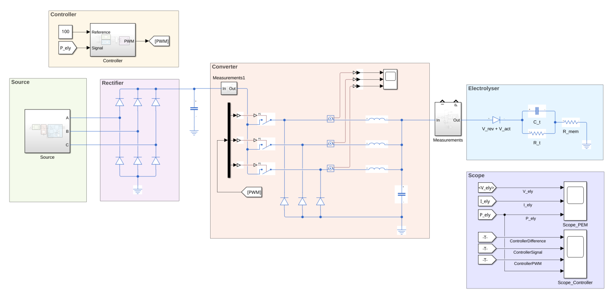
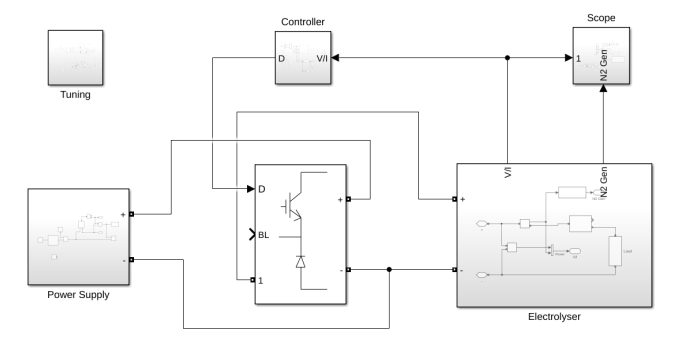
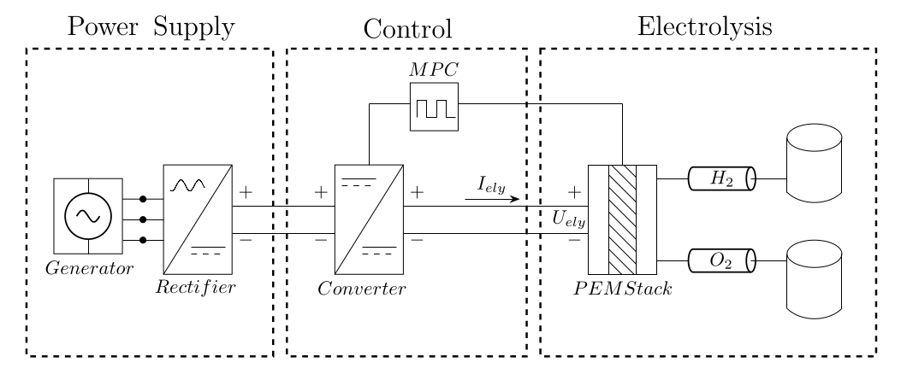

# Master Thesis

Welcome to my Git repo for my master thesis on **Dynamic Modelling and Control of a Grid-Connected PEM Electrolyser Using PID and MPC**

The full thesis can be found here: [Thesis.pdf](Thesis.pdf).

## About
The project was completed in two parts, the first being through my research and development project and the later being the thesis building on top of said project 

### Research and Development
The project was to expand on my research and development project from the previous semester where I designed a control solution around the [PEM Electrolysis System](https://se.mathworks.com/help/simscape/ug/pem-electrolysis-system.html) from MATLAB by creating an equivalent circuit model based on a Randles circuit which imitates the electrical properties of electrodes. The electrolyser equivalent was connected to a buck converter to step down the high voltage photovoltaic arrays to a more sensible level for electrolysers (25V), since they're high current low voltage devices. The project was simulated with low temporal resolution across hours to limit RAM usage and 

### Thesis
The goal of the Thesis was to take the findings of the research and development project and continue from there, introducing a three phase power source emulating that of grid-connected wind turbines rather than photovoltaics. Additionally Model Predictive Control was used and compared to PID in ease of implementation, stability and control. Thermal. The system was placed under heavy stress from factors such as grid faults, shorts, Switch failure of the interleaved buck converter. Heavy harmonics caused by other devices. The noise suppression capabilities of PID and MPC were also tested against each other with reference to a completely non-controlled noise output.

## The process
